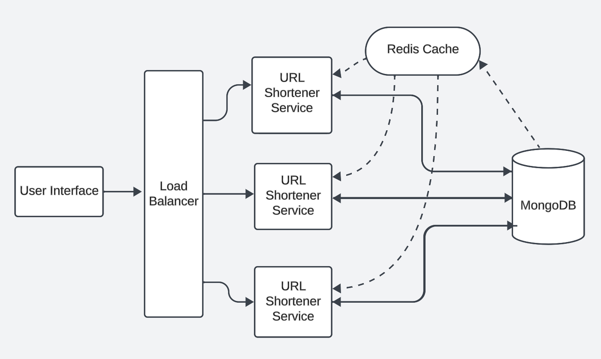

# SwiftShort
SwiftShort is a URL shortener. I made it primarily for learning basic system design and backend development. It is written in Node.js.

## Instructions to Set up the Repository

1. Clone the repository
2. Go the frontend directory and run `index.html` in your browser.
3. Go the backend directory and run `npm install`.
4. Change the name of ``.env.example`` to ``.env`` and fill the environment variables.
5. Go to redis cloud to start the redis server instance and use **Redis-Client** code snippet's credentials in your ``.env ``file.
6. Run `npm start` to start the server.

## Using Docker to Set up the Repository
1. Clone the repository.
2. Change the name of ``.env.example`` to ``.env`` and fill the environment variables.
3. Run ``docker-compose build`` to build the containers.
4. Run ``docker-compose up -d`` to start the containers. 
5. Frontend runs on port 3000 and backend runs on port 5000.

## Using the Shortener

1. In ``index.html`` insert the URL you want to shorten in the input field.
3. Paste the shortened URL in your browser to be redirected to the original URL.

## System Design
